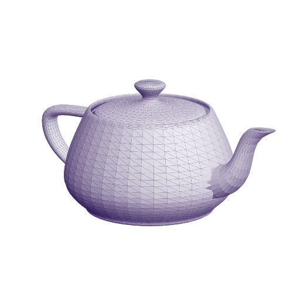
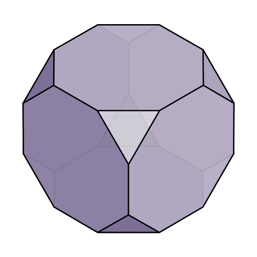
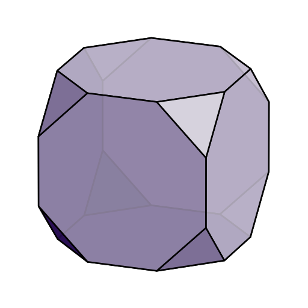
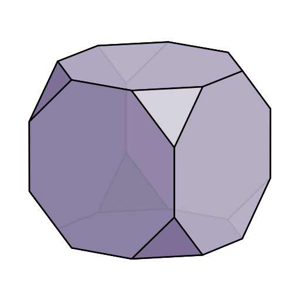
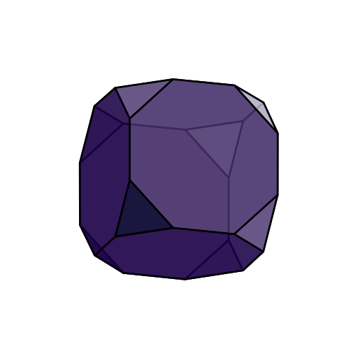

<div>
   
   
   
   
</div>

<!-- Mesh data sources (rendered using svg3d): -->
<!-- https://imagetostl.com/convert/file/ply/to/obj#convert -->
<!-- https://www.cs.cmu.edu/~kmcrane/Projects/ModelRepository/ -->


This is a simple Python library for generating 3D wireframes in SVG format, and a
reimagining of the excellent [original library](https://prideout.net/blog/svg_wireframes/#using-the-api)
with the same name: this version has a more general interface, new features, and a somewhat different scope. For a
description of how the original was designed and implemented, check out
[this blog post](https://prideout.net/blog/svg_wireframes/#using-the-api).

## Installation

```bash

# Clone the repository
git clone https://github.com/janbridley/svg3d.git
cd svg3d

# Install to your python environment!
python -m pip install .

```


## Quickstart Example

`svg3d` provides convenience `View` options for standard rendering perspectives -
isometric, dimetric, and trimetric. Shapes can be easily created from coxeter objects,
or from raw mesh data.

```python

from coxeter.families import ArchimedeanFamily

import svg3d


style = dict(
    fill="#00B2A6",
    fill_opacity="0.85",
    stroke="black",
    stroke_linejoin="round",
    stroke_width="0.005",
)

scene = [
    svg3d.Mesh.from_coxeter(
        truncated_cube, style=style, shader=svg3d.shaders.diffuse_lighting
    )
]

# Convenience views: isometric, dimetric, and trimetric
iso = svg3d.View.isometric(scene, fov=1.0)
dim = svg3d.View.dimetric(scene, fov=1.0)
tri = svg3d.View.trimetric(scene, fov=1.0)


for view, view_type in zip([iso, dim, tri], ["iso", "dim", "tri"]):

    svg3d.Engine([view]).render(f"doc/svgs/{view_type}.svg")


```

| Isometric | Dimetric | Trimetric |
|-----------|----------|-----------|
|  |  |  |


## Usage Example


For finer control over the viewport and settings, use the following built-in methods to generate
OpenGL-style perspective and view matrixes.

```python
from coxeter.families import ArchimedeanFamily

import svg3d
from svg3d import get_lookat_matrix, get_projection_matrix


def generate_svg(filename, poly):
    pos_object = [0.0, 0.0, 0.0]  # "at" position
    pos_camera = [40, 40, 120]  # "eye" position
    vec_up = [0.0, 1.0, 0.0]  # "up" vector of camera. This is the default value.

    z_near, z_far = 1.0, 200.0
    aspect = 1.0  # Aspect ratio of the view cone
    fov_y = 1.0  # Opening angle of the view cone. fov_x is equal to fov_y * aspect

    look_at = get_lookat_matrix(pos_object, pos_camera, vec_up=vec_up)
    projection = get_projection_matrix(
        z_near=z_near, z_far=z_far, fov_y=fov_y, aspect=aspect
    )

    # A "scene" is a list of Mesh objects, which can be easily generated from Coxeter!
    scene = [svg3d.Mesh.from_poly(poly, style=style)]

    view = svg3d.View.from_look_at_and_projection(
        look_at=look_at,
        projection=projection,
        scene=scene,
    )

    svg3d.Engine([view]).render(filename)


style = dict(
    fill="#00B2A6",
    fill_opacity="0.85",
    stroke="black",
    stroke_linejoin="round",
    stroke_width="0.005",
)

truncated_cube = ArchimedeanFamily.get_shape("Truncated Cube")
generate_svg(filename="truncated_cube.svg", poly=truncated_cube)
```

Running the code above generates the following image, using a simple dot-product
(diffuse) lighting model included in `svg3d.shaders`:



And that's all it takes! For an even simpler startup, use one of the built in viewports.
