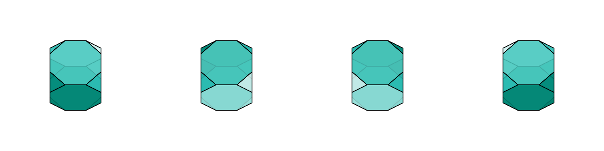
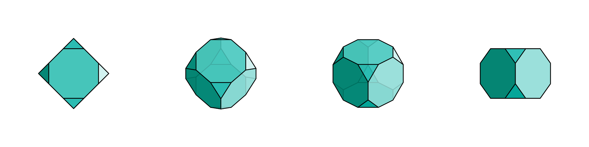
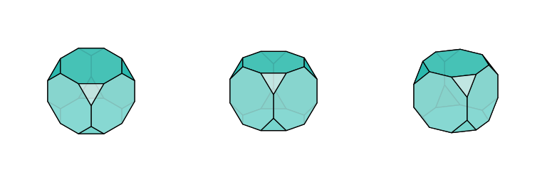
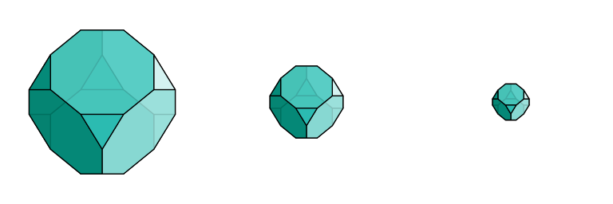
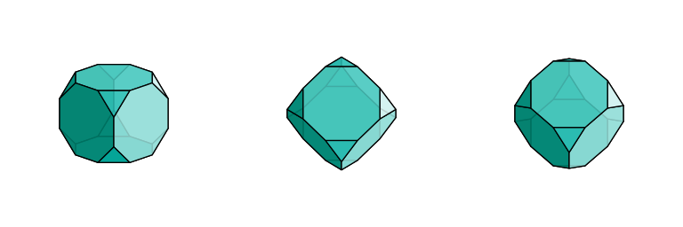

.. _orthographic_views:

Orthographic Views
==================

Orthographic (parallel) projection is the foundation of technical and scientific visualization.
Unlike perspective projection, orthographic views preserve measurements and parallel lines,
making them ideal for diagrams, engineering drawings, and scientific publications.

This guide covers the ``View.orthographic`` API and the convenience methods for standard
axonometric projections.

.. _orthographic_basics:

Basic Orthographic View
-----------------------

The ``View.orthographic`` method creates a front view by default, with optional scene
rotation via ``azimuth`` and ``tilt`` parameters:

.. code-block:: python

   import svg3d

   view = svg3d.View.orthographic(
       scene=scene,
       scene_width=3.0,       # Width of view volume in world units
       aspect_ratio=1.0,      # Width/height ratio of viewport
       azimuth=45.0,          # Scene rotation around Z axis
       tilt=35.264,           # Scene rotation around X axis
   )

   svg3d.Engine([view]).render("output.svg")

**Parameters:**

- ``scene``: List of Mesh objects to render
- ``scene_width``: Width of the view volume (larger = more zoomed out)
- ``aspect_ratio``: Width/height ratio of the viewport
- ``azimuth``: Scene rotation around Z axis in degrees (horizontal spin)
- ``tilt``: Scene rotation around X axis in degrees (vertical tilt)

.. _azimuth_tilt:

Understanding Azimuth and Tilt
------------------------------

The scene orientation is controlled by two rotation angles applied *before* the camera:

**Azimuth** - Rotation around Z axis
  Controls horizontal rotation of the scene:

  - ``azimuth=0°``: No rotation (default)
  - ``azimuth=90°``: Scene rotated 90° counterclockwise when viewed from above
  - ``azimuth=180°``: Scene rotated 180°
  - ``azimuth=270°``: Scene rotated 270° counterclockwise

**Tilt** - Rotation around X axis
  Controls vertical tilt of the scene:

  - ``tilt=0°``: No tilt (front view)
  - ``tilt=45°``: Scene tilted 45° backward
  - ``tilt=90°``: Scene tilted to top-down view

.. _layered_design:

Layered Design
^^^^^^^^^^^^^^

The orthographic view uses a two-layer approach:

::

   Scene geometry → Rz(azimuth) @ Rx(tilt) → Camera(front view) → Projection → Output

This separates the *projection type* (always orthographic) from the *scene orientation*,
making it easy to rotate the scene while maintaining a consistent view.

.. _azimuth_example:

Azimuth Rotation Example
^^^^^^^^^^^^^^^^^^^^^^^^

The following shows the same scene rotated at four angles:

*Left to right: azimuth=0°, azimuth=90°, azimuth=180°, azimuth=270°*

**Code:**

.. code-block:: python

   for azimuth in [0, 90, 180, 270]:
       view = svg3d.View.orthographic(
           scene=scene,
           scene_width=3.0,
           aspect_ratio=1.0,
           azimuth=azimuth,
           tilt=30.0,
       )

.. _tilt_example:

Tilt Example
^^^^^^^^^^^^

The following shows how tilt affects the vertical viewing angle:

*Left to right: tilt=0° (front), tilt=30°, tilt=60°, tilt=90° (top-down)*

**Code:**

.. code-block:: python

   for tilt in [0, 30, 60, 90]:
       view = svg3d.View.orthographic(
           scene=scene,
           scene_width=3.0,
           aspect_ratio=1.0,
           azimuth=45.0,
           tilt=tilt,
       )

.. list-table::
   :header-rows: 1

   * - Tilt
     - Effect
   * - 0°
     - Front view: looking along +z axis
   * - 35.264°
     - Isometric-equivalent view
   * - 90°
     - Top-down: looking down from +z

.. _axonometric:

Standard Axonometric Projections
--------------------------------

svg3d provides convenience methods for the three standard axonometric projections.
Each method sets up the camera for that projection type, with optional ``azimuth``
and ``tilt`` parameters for additional scene rotation:

*Left to right: Isometric, Dimetric, Trimetric*

Isometric Projection
^^^^^^^^^^^^^^^^^^^^

All three coordinate axes are equally foreshortened. The camera is positioned at
theta=45° and elevation=35.264° (arcsin(1/√3)).

.. code-block:: python

   # Basic isometric view
   view = svg3d.View.isometric(scene, scene_width=4.0)

   # Isometric with scene rotated 30° around Z
   view = svg3d.View.isometric(scene, scene_width=4.0, azimuth=30.0)

   # Isometric with scene tilted 15° around X
   view = svg3d.View.isometric(scene, scene_width=4.0, tilt=15.0)

Dimetric Projection
^^^^^^^^^^^^^^^^^^^

Two coordinate axes are equally foreshortened, the third has different foreshortening.
The camera is positioned at theta=45° and elevation=20.705° (arcsin(1/√8)).

.. code-block:: python

   # Basic dimetric view
   view = svg3d.View.dimetric(scene, scene_width=4.0)

   # Dimetric with scene rotation
   view = svg3d.View.dimetric(scene, scene_width=4.0, azimuth=45.0, tilt=10.0)

Trimetric Projection
^^^^^^^^^^^^^^^^^^^^

All three coordinate axes have different foreshortening. The camera is positioned at
theta=30° and elevation=25° for a natural-looking view.

.. code-block:: python

   # Basic trimetric view
   view = svg3d.View.trimetric(scene, scene_width=4.0)

   # Trimetric with scene rotation
   view = svg3d.View.trimetric(scene, scene_width=4.0, azimuth=20.0, tilt=5.0)

.. _scene_rotation:

Scene Rotation for Axonometric Views
^^^^^^^^^^^^^^^^^^^^^^^^^^^^^^^^^^^^^

The ``azimuth`` and ``tilt`` parameters on convenience methods allow you to rotate
the scene *within* the chosen projection type:

.. code-block:: python

   # Maintain isometric projection while spinning the scene
   for angle in [0, 45, 90, 135]:
       view = svg3d.View.isometric(scene, azimuth=angle)
       svg3d.Engine([view]).render(f"isometric_{angle}.svg")

This is useful when you want the visual characteristics of a specific projection
(isometric, dimetric, or trimetric) but need to orient the scene differently.

.. _scene_width_aspect:

Scene Width and Aspect Ratio
-----------------------------

Scene Width
^^^^^^^^^^^

The ``scene_width`` parameter controls the horizontal extent of the view volume.
Larger values show more of the scene (zoom out), smaller values show less (zoom in).

*Left to right: scene_width=2.0 (zoomed in), scene_width=4.0, scene_width=8.0 (zoomed out)*

**Code:**

.. code-block:: python

   # Zoomed in (small scene_width)
   view_close = svg3d.View.orthographic(
       scene=scene,
       scene_width=2.0,  # Close view
       azimuth=45.0,
       tilt=35.264,
   )

   # Zoomed out (large scene_width)
   view_far = svg3d.View.orthographic(
       scene=scene,
       scene_width=8.0,  # Wide view
       azimuth=45.0,
       tilt=35.264,
   )

Aspect Ratio
^^^^^^^^^^^^

The ``aspect_ratio`` parameter controls the width/height ratio of the viewport.
Use this to match your output image dimensions.

.. code-block:: python

   # Square viewport
   view_square = svg3d.View.orthographic(
       scene=scene,
       scene_width=4.0,
       aspect_ratio=1.0,  # Square
       azimuth=45.0,
       tilt=35.264,
   )

   # Wide viewport (e.g., for panoramic views)
   view_wide = svg3d.View.orthographic(
       scene=scene,
       scene_width=4.0,
       aspect_ratio=2.0,  # 2:1 width:height
       azimuth=45.0,
       tilt=35.264,
   )

   # Render with matching pixel dimensions
   svg3d.Engine([view_wide]).render(
       "wide_view.svg",
       size=view_wide.viewport.get_size(base_height=512)
   )

.. _custom_views:

Custom Views
------------

You can create custom views by combining azimuth and tilt values to achieve
specific visual effects.

*Left to right: tilt=70° (top emphasis), tilt=15° (front emphasis), tilt=30° (game-style)*

Emphasizing Specific Faces
^^^^^^^^^^^^^^^^^^^^^^^^^^

.. code-block:: python

   # Emphasize top face (high tilt)
   view_top = svg3d.View.orthographic(
       scene=scene,
       scene_width=3.0,
       aspect_ratio=1.0,
       azimuth=45.0,
       tilt=70.0,  # High tilt shows more of top
   )

   # Emphasize front face (low tilt)
   view_front = svg3d.View.orthographic(
       scene=scene,
       scene_width=3.0,
       aspect_ratio=1.0,
       azimuth=45.0,
       tilt=15.0,  # Low tilt shows more of front
   )

Game-Style Isometric
^^^^^^^^^^^^^^^^^^^^

Classic isometric games often use approximately 30° tilt for a pleasing look:

.. code-block:: python

   # Classic game-style isometric view
   view_game = svg3d.View.orthographic(
       scene=scene,
       scene_width=3.0,
       aspect_ratio=1.0,
       azimuth=45.0,
       tilt=30.0,
   )

.. _common_configurations:

Common Configurations Reference
-------------------------------

+------------------+---------+--------+---------------------------------------------+
| View Type        | azimuth | tilt   | Description                                 |
+==================+=========+========+=============================================+
| Front view       | 0°      | 0°     | Looking along +z axis                       |
+------------------+---------+--------+---------------------------------------------+
| Isometric-equiv  | 45°     | 35.264°| All axes equally foreshortened              |
+------------------+---------+--------+---------------------------------------------+
| Dimetric-equiv   | 45°     | 20.705°| Two axes equally foreshortened              |
+------------------+---------+--------+---------------------------------------------+
| Top-down         | any     | 90°    | Looking straight down                       |
+------------------+---------+--------+---------------------------------------------+
| Game-style       | 45°     | 30°    | Classic game aesthetic                      |
+------------------+---------+--------+---------------------------------------------+

For true axonometric projections, use the convenience methods:

+------------------+---------+--------+---------------------------------------------+
| Method           | azimuth | tilt   | Effect                                      |
+==================+=========+========+=============================================+
| isometric()      | 0°      | 0°     | True isometric projection                   |
+------------------+---------+--------+---------------------------------------------+
| isometric()      | 45°     | 0°     | Isometric + 45° scene rotation              |
+------------------+---------+--------+---------------------------------------------+
| dimetric()       | 0°      | 0°     | True dimetric projection                    |
+------------------+---------+--------+---------------------------------------------+
| trimetric()      | 0°      | 0°     | True trimetric projection                   |
+------------------+---------+--------+---------------------------------------------+

.. _complete_example:

Complete Example
----------------

Here's a complete example that generates multiple views of a truncated cube:

.. code-block:: python

   from coxeter.families import ArchimedeanFamily
   import svg3d

   # Create the shape
   truncated_cube = ArchimedeanFamily.get_shape("Truncated Cube")

   style = {
       "fill": "#00B2A6",
       "fill_opacity": "0.85",
       "stroke": "black",
       "stroke_linejoin": "round",
       "stroke_width": "0.005",
   }

   scene = [
       svg3d.Mesh.from_coxeter(
           truncated_cube,
           shader=svg3d.shaders.DiffuseShader.from_style_dict(style)
       )
   ]

   # Generate standard axonometric views
   for method_name, method in [
       ("isometric", svg3d.View.isometric),
       ("dimetric", svg3d.View.dimetric),
       ("trimetric", svg3d.View.trimetric),
   ]:
       view = method(scene, scene_width=3.0)
       svg3d.Engine([view]).render(f"{method_name}.svg")

   # Generate isometric views with different scene rotations
   for angle in [0, 45, 90, 135]:
       view = svg3d.View.isometric(scene, scene_width=3.0, azimuth=angle)
       svg3d.Engine([view]).render(f"isometric_rotated_{angle}.svg")

   # Generate a custom view
   custom_view = svg3d.View.orthographic(
       scene=scene,
       scene_width=3.0,
       aspect_ratio=1.0,
       azimuth=60.0,
       tilt=40.0,
   )
   svg3d.Engine([custom_view]).render("custom_view.svg")

.. _scene_rotation_matrix:

Scene Rotation Matrix
---------------------

For advanced use cases, you can access the scene rotation matrix directly:

.. code-block:: python

   # Get the 4x4 rotation matrix for azimuth=30, tilt=15
   rotation_matrix = svg3d.get_scene_rotation_matrix(azimuth=30.0, tilt=15.0)

   # The matrix uses extrinsic rotation: Rz(azimuth) @ Rx(tilt)
   # This can be used for custom transformations
